<div align="center">
  <a href="https://memento-lemon.vercel.app/">
    
  </a>
</div>

<div align="center">
  
  <a href="https://github.com/patelatwork?tab=followers">
    
  </a>
  <a href="https://memento-lemon.vercel.app/">
    
  </a>
</div>

<hr>

## :book: 𝙰𝚋𝚘𝚞𝚝 𝙼𝚎
🚀 Innovative **Computer Science Undergrad** & **AI Enthusiast** from IIIT Sricity.  


### 🧐 𝙰𝚛𝚎𝚊𝚜 𝚘𝚏 𝙸𝚗𝚝𝚎𝚛𝚎𝚜𝚝
*    **Generative AI & Agentic Ai**
*    **Data Science & Predictive Analytics**
*    **Machine Learning & Deep Learning**
*    **Natural Language Processing**
*    **Backend Development & Software Engineering**

### 💻 𝚃𝚎𝚌𝚑 𝚂𝚝𝚊𝚌𝚔
<p align="left">
  <!-- Languages -->
  
  
  
  
  
  
  
  
  <!-- AI/ML Frameworks & Libs -->
  
  
  
  
  
  <!-- Data Science -->
  
  
  
  
  
  

  <!-- NLP & Agentic AI -->
  
  
  
  
  
  
  

  <!-- Web Dev -->
  
  
  
  
  
  

  <!-- Database & Tools -->
  
  
  
  
  
  

  <!-- Visualization -->
  
  
  

  <!-- Platforms -->
  
  
  
</p>

<hr>

## 📈 𝙶𝚒𝚝𝙷𝚞𝚋 𝚂𝚝𝚊𝚝𝚜

<div align="center">


<details>
  <summary>📊 More stats</summary>
  <br>
  
  
</details>

<br>


<picture>
  <source media="(prefers-color-scheme: dark)" srcset="https://raw.githubusercontent.com/patelatwork/patelatwork/output/snake-dark.svg" />
  <source media="(prefers-color-scheme: light)" srcset="https://raw.githubusercontent.com/patelatwork/patelatwork/output/snake.svg" />
  
</picture>

</div>

<hr>

## ⬆ 𝚆𝚑𝚊𝚝 𝙸'𝚖 𝚞𝚙 𝚝𝚘
- 🔨 𝙸'𝚖 𝚌𝚞𝚛𝚛𝚎𝚗𝚝𝚕𝚢...
```yaml
- Working on projects like Multivariate Time Series Forecasting of the air pollutants and exploring the VLM Training.
```
<!-- - Developing Nexus, the cross-platform, all-in-one, CharaChorder desktop app! -->
<!-- - 🔨 𝙸’𝚖 𝚌𝚞𝚛𝚛𝚎𝚗𝚝𝚕𝚢 𝚠𝚘𝚛𝚔𝚒𝚗𝚐 𝚘𝚗 𝚊 𝚗𝚎𝚠 [**𝚒𝟹𝚕𝚘𝚌𝚔-𝚌𝚘𝚕𝚘𝚛**](https://github.com/Raymo111/i3lock-color) 𝚛𝚎𝚕𝚎𝚊𝚜𝚎
- 🎯 𝙸𝚗 𝚝𝚑𝚎 𝚗𝚎𝚊𝚛 𝚏𝚞𝚝𝚞𝚛𝚎, 𝙸 𝚙𝚕𝚊𝚗 𝚝𝚘... -->
- 🤞 𝙾𝚗𝚎 𝚍𝚊𝚢 𝙸 𝚑𝚘𝚙𝚎 𝚝𝚘...
	- Learn Piano!

<hr>

## 📫 𝙷𝚘𝚠 𝚝𝚘 𝚛𝚎𝚊𝚌𝚑 𝚖𝚎:


<p align="center">
  <a href="https://www.linkedin.com/in/dhruv-patel-16a23628a/">
    
  </a>
  &nbsp;
  <a href="https://www.instagram.com/dhruv__93/">
    
  </a>
  &nbsp;
  <a href="https://x.com/Dhruv9756">
    
  </a>
</p>

<hr>
